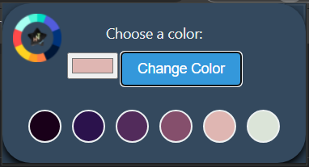
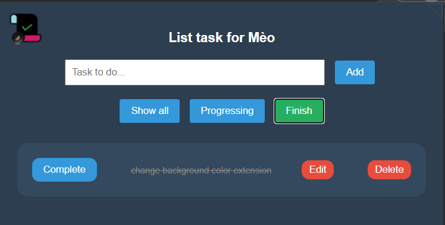

# extension-lor
> [Description](#description) | [Install](#install) | [Setup](#load-the-extension) | [Screenshot Demo](#screenshot) | [Main Features include](#main-features-include)
## Description:
- chrome extension
## Install:
```bash
git clone https://github.com/Meoleodeo/extension-lor
echo done
```
## Load the Extension:
1. Open Chrome and navigate to chrome://extensions/.
2. Enable "Developer mode" in the top right.
3. Click "Load unpacked" and select your extension folder.
## Screenshot:


## Main Features include:
- Depends on each extension
- update later
